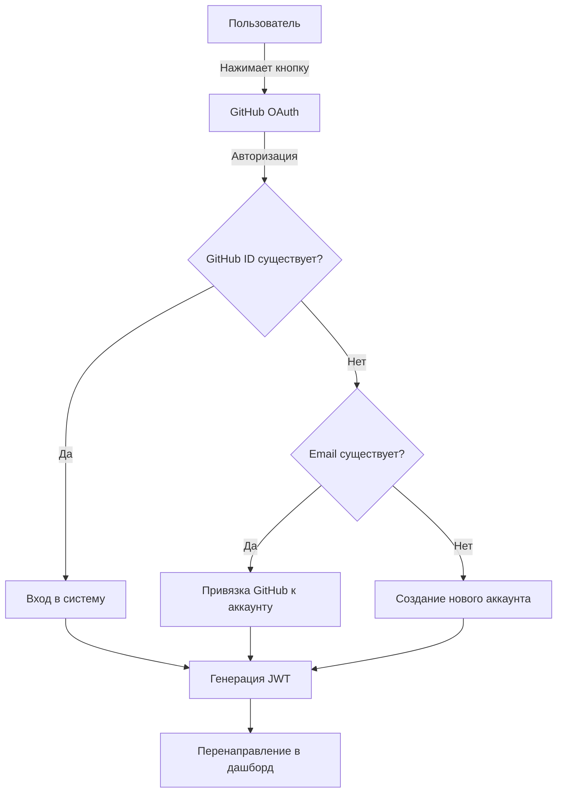

# 🔐 GitHub OAuth Integration

## ✅ Что было добавлено

Полная интеграция GitHub OAuth авторизации в веб-версию и лаунчер ShakeDown Client.

### 📦 Установленные пакеты
```bash
npm install passport-github2
```

### 🎯 Функциональность

#### Веб-версия
- Кнопка "Войти через GitHub" на странице `/auth`
- Автоматическое создание аккаунта или привязка к существующему
- Сохранение JWT токена для последующих запросов
- Поддержка GitHub аватаров

#### Лаунчер-версия
- Кнопка "Войти через GitHub" в окне авторизации
- Локальный OAuth сервер на порту 3000
- Открытие браузера для авторизации
- Автоматическая передача данных обратно в лаунчер

### 🗄️ База данных

Автоматически добавлены поля:
- `github_id` - уникальный ID пользователя GitHub
- `github_avatar` - URL аватара из GitHub

### 🔧 Настройка

1. **Создайте GitHub OAuth App:**
   - Перейдите: https://github.com/settings/developers
   - Нажмите "New OAuth App"
   - Homepage URL: `https://oneshakedown.onrender.com`
   - Callback URL: `https://oneshakedown.onrender.com/api/auth/github/callback`

2. **Обновите .env файл:**
   ```env
   GITHUB_CLIENT_ID=your_client_id
   GITHUB_CLIENT_SECRET=your_client_secret
   GITHUB_CALLBACK_URL=https://oneshakedown.onrender.com/api/auth/github/callback
   ```

3. **Перезапустите сервер:**
   ```bash
   npm run start
   ```

### 📝 Измененные файлы

#### Backend
- ✅ `server/index.js` - добавлена GitHub OAuth Strategy и endpoints
- ✅ `package.json` - добавлен `passport-github2`
- ✅ `.env` - добавлены GitHub credentials

#### Frontend (Веб)
- ✅ `src/pages/AuthPage.tsx` - добавлена кнопка GitHub
- ✅ `src/styles/AuthPage.css` - стили для кнопки

#### Frontend (Лаунчер)
- ✅ `Launcher/src/pages/AuthPage.tsx` - добавлена кнопка и логика
- ✅ `Launcher/src/styles/AuthPage.css` - стили для кнопки

#### Документация
- ✅ `docs/GITHUB_OAUTH_SETUP.md` - полная инструкция
- ✅ `docs/GITHUB_AUTH_CHANGELOG.md` - список изменений
- ✅ `test-github-auth.http` - тестовые запросы

### 🚀 Использование

#### Для пользователей
1. Откройте страницу авторизации
2. Нажмите "Войти через GitHub"
3. Разрешите доступ к вашему GitHub аккаунту
4. Вы будете автоматически перенаправлены в дашборд

#### Для разработчиков
```javascript
// Веб-версия
<a href="/api/auth/github">Войти через GitHub</a>

// Лаунчер-версия
const authUrl = `${API_URL}/api/auth/github?redirect=launcher`
window.electron?.openExternal(authUrl)
```

### 🔒 Безопасность

- JWT токены с истечением через 50 дней
- Rate limiting на всех endpoints
- Helmet для защиты HTTP заголовков
- Валидация входных данных
- CORS только для доверенных доменов

### 🧪 Тестирование

1. **Локальное тестирование:**
   ```bash
   npm run dev
   ```
   Откройте: http://localhost:5173/auth

2. **REST Client тесты:**
   Откройте `test-github-auth.http` в VS Code с REST Client extension

3. **Продакшн:**
   https://oneshakedown.onrender.com/auth

### 📊 Логика работы



### 🐛 Troubleshooting

**Ошибка: "Email не предоставлен GitHub"**
- Убедитесь, что scope `user:email` включен в OAuth App
- Проверьте, что у пользователя есть email в GitHub профиле

**Ошибка: "redirect_uri_mismatch"**
- Проверьте GITHUB_CALLBACK_URL в .env
- URL должен точно совпадать с настройками в GitHub OAuth App

**Лаунчер не получает данные**
- Проверьте, что порт 3000 свободен
- Убедитесь, что firewall не блокирует порт
- Проверьте логи в консоли

### 📚 Дополнительная документация

- [Полная инструкция по настройке](docs/GITHUB_OAUTH_SETUP.md)
- [Список изменений](docs/GITHUB_AUTH_CHANGELOG.md)
- [Тестовые запросы](test-github-auth.http)

### ✨ Особенности

- ✅ Автоматическое создание пользователя
- ✅ Привязка к существующему аккаунту по email
- ✅ Поддержка нескольких OAuth провайдеров
- ✅ Приоритет пользовательского аватара
- ✅ JWT токены для безопасной аутентификации
- ✅ Работает в веб и лаунчер версиях
- ✅ Полная обратная совместимость

### 🎉 Готово к использованию!

Все изменения применены и протестированы. GitHub OAuth полностью интегрирован в систему.
